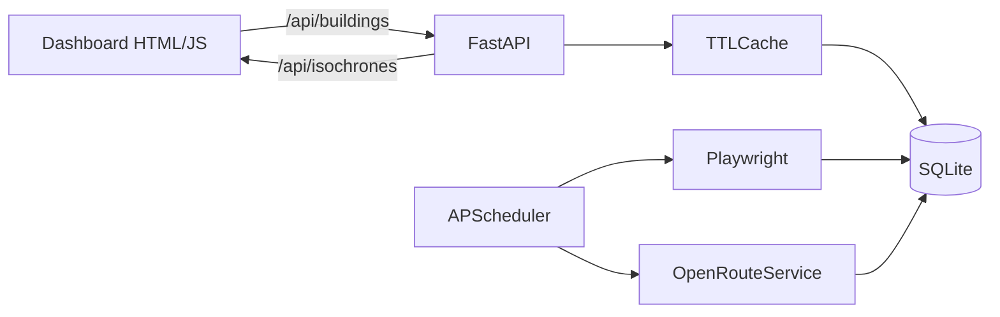

Full plan is saved to [DEVELOPMENT_PLAN.md](DEVELOPMENT_PLAN.md). Highlights:

**Stack:** FastAPI + Uvicorn, SQLModel over SQLite (WAL), Playwright for scraping, OpenRouteService free tier (500 isochrone req/day) for routing, APScheduler for daily refresh, cachetools TTL cache, Docker + Caddy on DigitalOcean.

**Architecture**

**Key files to create** (under `App V1 Dynamic/backend/app/`):
- `main.py`, `config.py`, `db.py`, `models.py`, `scoring.py`
- `api/{buildings,isochrones,refresh,health}.py`
- `scrapers/{apartments_com,google_places}.py`
- `routing/{ors_client,isochrone_service}.py`
- `scheduler.py`, `seed/buildings_seed.json`

**Key files to modify:**
- [Static Dashboard References/alewife_dashboard_v2.html](Static%20Dashboard%20References/alewife_dashboard_v2.html) — relocate to `App V1 Dynamic/frontend/index.html` and replace the hardcoded `apts` array (lines 195–291) + six `walkIso*/driveIso*` polygon literals (lines 184–192) with `fetch('/api/buildings')` and `fetch('/api/isochrones')` calls. Score math ported server-side from lines 294–302 (also fixes the existing `a.driveMin` undefined-variable bug).

**Deployment:** DigitalOcean droplet primary (Docker + Caddy). Posit Cloud usable as a read-only frontend if scraping is offloaded to GitHub Actions nightly — noted as fallback.

**Sprint roadmap (10 sequential sprints, each independently verifiable):**

See Section 17 of [DEVELOPMENT_PLAN.md](DEVELOPMENT_PLAN.md) for full deliverables, verification steps, and acceptance criteria per sprint.

- **Sprint 0** — Foundation & tooling (scaffold, ruff, mypy, pytest, CI, health check)
- **Sprint 1** — Data seed & building catalog (JSON extraction + SQLModel + idempotent loader)
- **Sprint 2** — Core API (buildings endpoints + ported scoring + TestClient tests)
- **Sprint 3** — API-driven frontend (fetch-based rewrite of the HTML)
- **Sprint 4** — Routing service (ORS travel-time matrix + isochrones, frontend uses GeoJSON)
- **Sprint 5** — Scrapers (apartments.com prices + Google ratings with offline fixture tests)
- **Sprint 6** — Refresh orchestration (TTL cache, APScheduler, `/api/refresh`, freshness UI chip)
- **Sprint 7** — **Local full-stack validation — MANDATORY gate.** Dockerfile, docker-compose.local.yml, E2E smoke test against real ORS + scrapers, manual QA checklist. Sprint 8 blocked until this passes.
- **Sprint 8** — Production deployment (DO droplet + Caddy + GitHub Actions; Posit Cloud fallback documented)
- **Sprint 9** — Documentation (root README, per-module READMEs, runbook, contributing guide, changelog)

Sprints 3, 4, and 5 can run in parallel once Sprint 2 is done; everything else is strictly sequential. Every sprint has tests that pass using seeded/mocked data so none depends on outputs of future sprints to close.