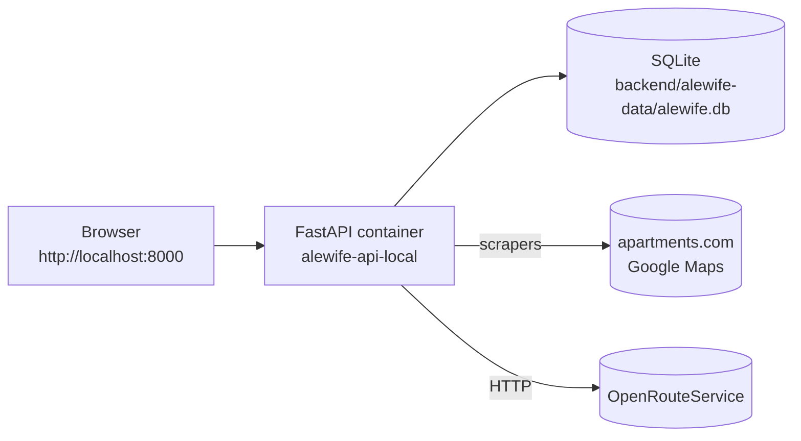

# Run Alewife Locally

Step-by-step guide to run the Alewife Apartment Intelligence dashboard end-to-end on your own machine, using Docker. Follow top-to-bottom; no prior context assumed.

---

## Table of Contents

- [Overview](#overview)
- [Prerequisites](#prerequisites)
- [1. Clone the repo](#1-clone-the-repo)
- [2. Configure environment variables](#2-configure-environment-variables)
- [3. Build and launch the container](#3-build-and-launch-the-container)
- [4. Seed the database](#4-seed-the-database)
- [5. Run the first data refresh](#5-run-the-first-data-refresh)
- [6. Open the dashboard](#6-open-the-dashboard)
- [7. Verify everything works](#7-verify-everything-works)
- [Day-to-day commands](#day-to-day-commands)
- [Troubleshooting](#troubleshooting)
- [Tearing it down](#tearing-it-down)

---

## Overview

The stack is a single FastAPI + Playwright container that serves both the REST API and the static dashboard. SQLite lives on a bind-mounted host directory so you can inspect the DB between runs.



You'll follow seven numbered steps, then spot-check the result against a checklist.

---

## Prerequisites

- **Docker Desktop 4.x+** (includes Docker Engine and Docker Compose v2). Install from [docker.com/get-started](https://www.docker.com/products/docker-desktop/).
- **Git** ([download](https://git-scm.com/downloads)).
- **PowerShell 5.1+** on Windows, or any POSIX shell (bash/zsh) on macOS / Linux.
- **An OpenRouteService API key** — free, from [openrouteservice.org](https://openrouteservice.org/dev/#/signup). Needed in step 2.

You do **not** need Python, Node, Playwright, or an IDE installed on the host. Everything runs inside the container.

Quick sanity check:

```bash
docker version
docker compose version
```

Both should print a version without errors.

---

## 1. Clone the repo

```bash
git clone https://github.com/<your-org>/ApartmentsDotLloyd.git
cd ApartmentsDotLloyd
```

Everything in this guide is run from the repo root (the folder containing `Makefile` and `make.ps1`).

---

## 2. Configure environment variables

Copy the example into `App V1 Dynamic/backend/.env` and fill in the three required values.

**macOS / Linux**

```bash
cp "App V1 Dynamic/backend/.env.example" "App V1 Dynamic/backend/.env"
```

**Windows PowerShell**

```powershell
Copy-Item "App V1 Dynamic/backend/.env.example" "App V1 Dynamic/backend/.env"
```

Open the new `.env` and set:

- `ORS_API_KEY` → paste the key from your OpenRouteService dashboard.
- `REFRESH_BEARER_TOKEN` → a 32+ char random string that protects `POST /api/refresh`. Generate one with PowerShell:

  ```powershell
  $b=New-Object byte[] 32
  [System.Security.Cryptography.RandomNumberGenerator]::Create().GetBytes($b)
  [Convert]::ToBase64String($b) -replace '[+/=]'
  ```

  Or with OpenSSL:

  ```bash
  openssl rand -hex 32
  ```

- `DATABASE_URL` → leave as the default. The container overrides it to `sqlite:////srv/data/alewife.db` automatically.

Leave `MBTA_API_KEY` blank (reserved for a future feature).

> `.env` is gitignored. Don't commit it.

---

## 3. Build and launch the container

From the repo root:

**macOS / Linux**

```bash
make up-local
```

**Windows PowerShell**

```powershell
./make.ps1 up-local
```

The first run takes roughly 3–5 minutes because Docker pulls the ~1.5 GB Playwright base image (Chromium included). Subsequent runs take under 30 seconds.

When it finishes you should see:

```
Dashboard: http://localhost:8000/
Health:    http://localhost:8000/api/health
```

Tail the logs in a second terminal if you want to watch the app boot:

```bash
make logs-local
```

You should see the FastAPI startup banner and a `Application startup complete.` line.

---

## 4. Seed the database

The buildings catalog lives in a JSON file checked into the repo. Load it into the SQLite DB inside the container:

```bash
make seed
```

Expected output (exact counts may vary slightly between versions):

```
Seed load complete: inserted=19 updated=0
```

Re-running `make seed` is safe — it updates existing rows in place and never duplicates.

---

## 5. Run the first data refresh

Pull live ORS routes, apartments.com prices, and Google Maps ratings for every building that has a scrape target:

```bash
make refresh-all
```

This takes about 4–7 minutes on a typical broadband connection. The output prints travel-time counts, isochrone counts, and per-building price/rating snapshots, finishing with something like:

```
travel_times: {'travel_times': 19} | isochrones: {'isochrones': 6}
prices: {'hanover-alewife': 'ok', 'cambridge-park': 'ok', ...}
ratings: {'hanover-alewife': 'ok', 'cambridge-park': 'ok', ...}
```

> If a scraper reports `rate-limited` for a building, wait 10–15 minutes and re-run. The scrapers include jitter and stealth but sites occasionally block.

---

## 6. Open the dashboard

Visit [http://localhost:8000/](http://localhost:8000/) in your browser. You should see:

- A blurb-box header reading **Alewife Apartment Intelligence**.
- A Leaflet map centered on Alewife with Red Line stops.
- Purple / green isochrone overlays around the T and the Route 2 ramp.
- A building list on the right with rent bands and a **Freshness** chip.
- A hidden **Refresh now** button — see the [day-to-day commands](#day-to-day-commands) section for how to wire it up manually in the browser.

The freshness chip should read `Freshness: just now` immediately after step 5.

---

## 7. Verify everything works

Run the automated smoke suite against the running container. These tests consume ORS quota and hit live sites, so only run them when you want end-to-end confidence.

```bash
make smoke-e2e
```

All seven tests should pass in under 10 minutes. If any fail, check [Troubleshooting](#troubleshooting).

Pair this with [LOCAL_VALIDATION.md](./LOCAL_VALIDATION.md) for a manual QA checklist.

---

## Day-to-day commands

| Command | What it does |
| --- | --- |
| `make up-local` | Build image (if needed) and start the container in the background. |
| `make down-local` | Stop and remove the container. Data in `backend/alewife-data/` is preserved. |
| `make logs-local` | Tail the API logs. `Ctrl+C` to exit. |
| `make seed` | Load / upsert the buildings catalog. |
| `make refresh-all` | Re-run ORS + scrapers end-to-end. |
| `make smoke-e2e` | Run the E2E smoke suite against `localhost:8000`. |
| `make test` | Run the unit/integration suite on the host (no container required). |
| `make lint` | Ruff check + format check on the host. |

To trigger a one-off refresh from the browser, open the dev console on `http://localhost:8000/` and run:

```js
window.ALEWIFE_REFRESH_TOKEN = "<your REFRESH_BEARER_TOKEN from .env>";
location.reload();
```

The **Refresh now** button becomes visible after reload.

---

## Troubleshooting

### Port 8000 is already in use

Stop whatever is bound to `:8000` or edit `App V1 Dynamic/docker-compose.local.yml` to expose a different host port, e.g. `"8080:8000"`, then `make up-local` again.

### `Error response from daemon: no such container: alewife-api-local`

The container isn't running. Start it with `make up-local` first.

### Seed / refresh say `Table 'building' has no column named ...`

An old SQLite file from a previous version is lingering. Stop the container, delete the DB file, and retry:

```bash
make down-local
rm -f "App V1 Dynamic/backend/alewife-data/alewife.db"*
make up-local
make seed
```

### `refresh-all` hangs or prints `rate-limited`

apartments.com or Google blocked the headless Chromium. Stop the refresh (`Ctrl+C` in the seed terminal is fine — it's running `exec`), wait 10–15 minutes, then retry. You can also refresh a subset:

```bash
docker compose -f "App V1 Dynamic/docker-compose.local.yml" exec api \
  python -m app.refresh_cli --slugs hanover-alewife,cambridge-park
```

### ORS returns 403 / 429

You exceeded the free-tier daily quota (2000 requests/day). Wait 24 h or create a second key.

### The dashboard loads but shows no isochrones

Either the refresh never ran or it failed. Check `GET /api/isochrones` directly:

```bash
curl http://localhost:8000/api/isochrones | python -m json.tool | head -30
```

An empty `walk` / `drive` array means `make refresh-all` needs to run.

---

## Tearing it down

Stop everything and wipe local data:

```bash
make down-local
rm -rf "App V1 Dynamic/backend/alewife-data/"
```

The Docker image stays cached so the next `make up-local` is fast. To delete it entirely:

```bash
docker image rm alewife-api:local
```

---

← [Back to top](#run-alewife-locally)
