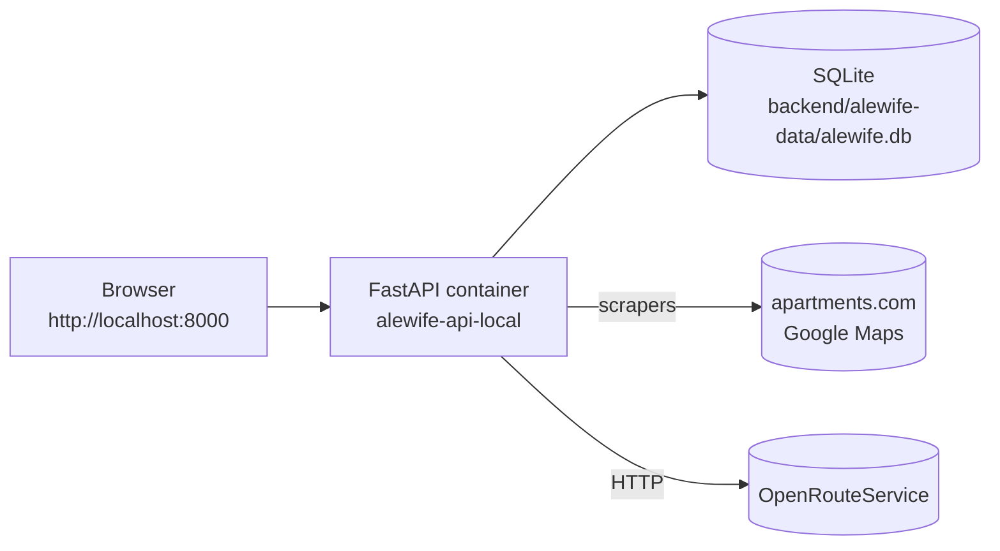

# Run Alewife Locally

Step-by-step guide to run the Alewife Apartment Intelligence dashboard end-to-end on your own machine, using Docker. Follow top-to-bottom; no prior context assumed.

---

## Table of Contents

- [Overview](#overview)
- [Prerequisites](#prerequisites)
- [1. Clone the repo](#1-clone-the-repo)
- [2. Configure environment variables](#2-configure-environment-variables)
- [3. Build and launch the container](#3-build-and-launch-the-container)
- [4. Seed the database](#4-seed-the-database)
- [5. Populate scrape targets](#5-populate-scrape-targets)
- [6. Run the first data refresh](#6-run-the-first-data-refresh)
- [7. Open the dashboard](#7-open-the-dashboard)
- [8. Verify everything works](#8-verify-everything-works)
- [Day-to-day commands](#day-to-day-commands)
- [Maintaining the catalog](#maintaining-the-catalog)
- [Troubleshooting](#troubleshooting)
- [Tearing it down](#tearing-it-down)

---

## Overview

The stack is a single FastAPI + Playwright container that serves both the REST API and the static dashboard. SQLite lives on a bind-mounted host directory so you can inspect the DB between runs.



You'll follow eight numbered steps, then spot-check the result against a checklist.

---

## Prerequisites

- **Docker Desktop 4.x+** (includes Docker Engine and Docker Compose v2). Install from [docker.com/get-started](https://www.docker.com/products/docker-desktop/).
- **Git** ([download](https://git-scm.com/downloads)).
- **PowerShell 5.1+** on Windows, or any POSIX shell (bash/zsh) on macOS / Linux.
- **An OpenRouteService API key** — free, from [openrouteservice.org](https://openrouteservice.org/dev/#/signup). Needed in step 2.

You do **not** need Python, Node, Playwright, or an IDE installed on the host. Everything runs inside the container.

Quick sanity check:

```bash
docker version
docker compose version
```

Both should print a version without errors.

---

## 1. Clone the repo

```bash
git clone https://github.com/<your-org>/ApartmentsDotLloyd.git
cd ApartmentsDotLloyd
```

Everything in this guide is run from the repo root (the folder containing `Makefile` and `make.ps1`).

---

## 2. Configure environment variables

Copy the example into `App V1 Dynamic/backend/.env` and fill in the three required values.

**macOS / Linux**

```bash
cp "App V1 Dynamic/backend/.env.example" "App V1 Dynamic/backend/.env"
```

**Windows PowerShell**

```powershell
Copy-Item "App V1 Dynamic/backend/.env.example" "App V1 Dynamic/backend/.env"
```

Open the new `.env` and set:

- `ORS_API_KEY` → paste the key from your OpenRouteService dashboard.
- `REFRESH_BEARER_TOKEN` → a 32+ char random string that protects `POST /api/refresh`. Generate one with PowerShell:

  ```powershell
  $b=New-Object byte[] 32
  [System.Security.Cryptography.RandomNumberGenerator]::Create().GetBytes($b)
  [Convert]::ToBase64String($b) -replace '[+/=]'
  ```

  Or with OpenSSL:

  ```bash
  openssl rand -hex 32
  ```

- `DATABASE_URL` → leave as the default. The container overrides it to `sqlite:////srv/data/alewife.db` automatically.

Leave `MBTA_API_KEY` blank (reserved for a future feature).

> `.env` is gitignored. Don't commit it.

---

## 3. Build and launch the container

From the repo root:

**macOS / Linux**

```bash
make up-local
```

**Windows PowerShell**

```powershell
./make.ps1 up-local
```

The first run takes roughly 3–5 minutes because Docker pulls the ~1.5 GB Playwright base image (Chromium included). Subsequent runs take under 30 seconds.

When it finishes you should see:

```
Dashboard: http://localhost:8000/
Health:    http://localhost:8000/api/health
```

Tail the logs in a second terminal if you want to watch the app boot:

```bash
make logs-local
```

You should see the FastAPI startup banner and a `Application startup complete.` line.

---

## 4. Seed the database

The buildings catalog lives in a JSON file checked into the repo. Load it into the SQLite DB inside the container:

```bash
make seed
```

Expected output (exact counts may vary slightly between versions):

```
Seed load complete: inserted=19 updated=0
```

Re-running `make seed` is safe — it updates existing rows in place and never duplicates.

---

## 5. Populate scrape targets

The price and rating scrapers need to know **which** `apartments.com` listing and **which** Google Maps place corresponds to each building. These URLs can't be auto-discovered reliably, so they live in a sidecar file you edit by hand: `App V1 Dynamic/backend/app/seed/scrape_targets.json`.

It ships with 19 rows of placeholders — every `apartments_com_url` and `google_place_id` is `null`. Until you replace at least one row with real values, `make refresh-all` will print `attempted=0` for both scrapers.

**Minimum: populate 2–3 buildings.** For each building you care about:

1. **`apartments_com_url`** — search `"<building name> <city>"` on [apartments.com](https://www.apartments.com/), open the listing, copy the URL. Shape: `https://www.apartments.com/<slug>/<id>/`.
2. **`google_place_id`** — the fastest way is the [Google Place ID Finder](https://developers.google.com/maps/documentation/javascript/examples/places-placeid-finder). Search the building, click the pin, copy the `ChIJ...` string. `place_id` is more durable than a Maps URL.

Edit the file so a populated entry looks like:

```json
"hanover-alewife": {
  "apartments_com_url": "https://www.apartments.com/hanover-alewife-cambridge-ma/abc123/",
  "google_place_id": "ChIJExampleAlewifePlaceIdHere"
}
```

Leave the rest as `null`; the scrapers skip those.

After editing, re-run the seed loader so the sidecar gets merged into the DB:

```bash
make seed
```

Expected output: `inserted=0 updated=<n>` where `<n>` is the number of rows you populated.

> You can come back and add more targets later. The loader is idempotent — `null` entries never overwrite existing values.

---

## 6. Run the first data refresh

Pull live ORS routes, apartments.com prices, and Google Maps ratings:

```bash
make refresh-all
```

This takes about 4–7 minutes on a typical broadband connection. The output prints travel-time counts, isochrone counts, and a summary of each scraper's work:

```
buildings: total=19 with_apartments_com_url=3 with_google_place_id=3
travel_times: {'walk': 19, 'drive': 19} | isochrones: {'walk': 3, 'drive': 3}
prices: PriceRefreshResult(attempted=3, succeeded=3, failed=0, skipped=16)
ratings: RatingRefreshResult(attempted=3, succeeded=3, failed=0, skipped=16)
```

Common signals:

- `attempted=0` for prices / ratings → step 5 wasn't completed. Edit `scrape_targets.json`, re-run `make seed`, and try again.
- `failed=N` > 0 → the site blocked the scraper. Wait 10–15 minutes and re-run; the scrapers include jitter and stealth but sites occasionally rate-limit.
- `skipped=N` is fine: those are buildings you chose not to populate.

---

## 7. Open the dashboard

Visit [http://localhost:8000/](http://localhost:8000/) in your browser. You should see:

- A blurb-box header reading **Alewife Apartment Intelligence**.
- A Leaflet map centered on Alewife with Red Line stops.
- Purple / green isochrone overlays around the T and the Route 2 ramp.
- A building list on the right with rent bands and a **Freshness** chip.
- A hidden **Refresh now** button — see the [day-to-day commands](#day-to-day-commands) section for how to wire it up manually in the browser.

The freshness chip should read `Freshness: just now` immediately after step 6.

---

## 8. Verify everything works

Run the automated smoke suite against the running container. These tests consume ORS quota and hit live sites, so only run them when you want end-to-end confidence.

```bash
make smoke-e2e
```

All seven tests should pass in under 10 minutes. If any fail, check [Troubleshooting](#troubleshooting).

Pair this with [LOCAL_VALIDATION.md](./LOCAL_VALIDATION.md) for a manual QA checklist.

---

## Day-to-day commands

| Command | What it does |
| --- | --- |
| `make up-local` | Build image (if needed) and start the container in the background. |
| `make down-local` | Stop and remove the container. Data in `backend/alewife-data/` is preserved. |
| `make logs-local` | Tail the API logs. `Ctrl+C` to exit. |
| `make seed` | Load / upsert the buildings catalog. |
| `make refresh-all` | Re-run ORS + scrapers end-to-end. |
| `make smoke-e2e` | Run the E2E smoke suite against `localhost:8000`. |
| `make test` | Run the unit/integration suite on the host (no container required). |
| `make lint` | Ruff check + format check on the host. |

To trigger a one-off refresh from the browser, open the dev console on `http://localhost:8000/` and run:

```js
window.ALEWIFE_REFRESH_TOKEN = "<your REFRESH_BEARER_TOKEN from .env>";
location.reload();
```

The **Refresh now** button becomes visible after reload.

---

## Maintaining the catalog

The list of buildings on the dashboard is fully driven by two JSON files. Add, edit, or remove buildings by editing these files and re-seeding — no code changes required. Do all of this while the container is running; `make seed` operates on the live DB.

### Prefer the agent? Use a Cursor Skill

If you're working through Cursor, two Agent Skills automate everything in this section end-to-end — URL parsing, JSON edits, DB cleanup, and verification. Just paste a URL in chat:

| Skill | Invoke by saying something like… |
| --- | --- |
| [`add-building`](../.cursor/skills/add-building/SKILL.md) | *"Add this to the dashboard: `https://maps.app.goo.gl/...` and `https://www.apartments.com/.../xyz/`"* |
| [`remove-building`](../.cursor/skills/remove-building/SKILL.md) | *"Remove `urbane-at-alewife` from the catalog"* |

Each skill walks an 8-phase checklist with a confirmation gate before any destructive step, and falls back to the manual instructions below if anything fails. The rest of this section is the canonical manual procedure — use it when editing by hand or when the skill's reference docs send you here.

### The two files

| File | Purpose |
| --- | --- |
| `App V1 Dynamic/backend/app/seed/buildings_seed.json` | Base catalog — name, address, coordinates, seed rent/rating, amenities. Top-level JSON array, one object per building. |
| `App V1 Dynamic/backend/app/seed/scrape_targets.json` | Sidecar telling the scrapers which `apartments.com` listing and Google place correspond to each building. Keyed by `slug`. |

Both files are merged on `slug`. Every run of `make seed` upserts by slug (inserts new, updates changed, leaves the rest alone), so you can re-run it as often as you want.

### Field reference for `buildings_seed.json`

| Field | Required? | Notes |
| --- | --- | --- |
| `slug` | **Yes** | URL-safe, lowercase, hyphenated. Globally unique. Never change it after the first seed — it's the join key for every snapshot table. |
| `name` | **Yes** | Display name shown in the UI. |
| `lat`, `lng` | **Yes** | WGS84 decimal degrees. Right-click the building in Google Maps to copy them. Aim for ≥ 5 decimal places. |
| `nbhd` | Recommended | Neighborhood badge (e.g. `"Cambridge"`, `"Arlington"`). |
| `address` | Recommended | Street address. Used as the Google-search fallback when a `google_place_id` isn't populated. |
| `rating`, `rc` | Optional | Seed rating + review count. Used when the ratings scraper finds nothing. |
| `studio`, `oneBR`, `twoBR` | Optional | Integer dollar floors — used when the prices scraper finds nothing. |
| `studioSrc`, `oneBRSrc`, `twoBRSrc` | Optional | Short display strings like `"from $2,932"` or `"est."` shown under each rent band. |
| `walk`, `drive` | Optional | Seed walk/drive minutes to the Alewife T / Route 2 ramp. Overridden by ORS after every `make refresh-all`. |
| `overview` | Optional | Free-text summary shown in the detail card. |
| `amenities` | Optional | Array of strings shown as badges. |
| `website`, `wlabel` | Optional | Official site URL + short label. |

### Add a new building

1. **Pick a slug.** Lowercase, hyphenated, unique across the file. Example: `the-metro-arlington`.

2. **Append a new object to `buildings_seed.json`** just before the closing `]`. Don't forget the comma after the previous building's `}`. Minimum viable entry:

   ```json
   {
     "slug": "the-metro-arlington",
     "name": "The Metro at Arlington",
     "nbhd": "Arlington",
     "address": "123 Mass Ave, Arlington, MA",
     "lat": 42.4154,
     "lng": -71.1565,
     "overview": "",
     "amenities": []
   }
   ```

   Fully-populated version (same shape as the existing 19):

   ```json
   {
     "slug": "the-metro-arlington",
     "name": "The Metro at Arlington",
     "nbhd": "Arlington",
     "address": "123 Mass Ave, Arlington, MA",
     "lat": 42.4154,
     "lng": -71.1565,
     "rating": 4.2,
     "rc": 87,
     "studio": 2200,
     "oneBR": 2800,
     "twoBR": 3600,
     "studioSrc": "from $2,200",
     "oneBRSrc": "est.",
     "twoBRSrc": "est.",
     "overview": "Near the Arlington T stop. Pet-friendly, quiet courtyard.",
     "amenities": ["W/D in unit", "Gym", "Rooftop Deck"],
     "walk": 18,
     "drive": 7,
     "website": "https://themetroarlington.com",
     "wlabel": "themetroarlington.com"
   }
   ```

3. **(Optional) Add scrape targets** in `scrape_targets.json` so prices + ratings get refreshed for the new building too. See [step 5 — Populate scrape targets](#5-populate-scrape-targets) for where to get the values.

   ```json
   "the-metro-arlington": {
     "apartments_com_url": "https://www.apartments.com/the-metro-arlington-ma/abc123/",
     "google_place_id": "ChIJExampleMetroPlaceId"
   }
   ```

   Leave both as `null` if you just want the pin on the map for now.

4. **Re-load the catalog.**

   ```powershell
   ./make.ps1 seed
   # -> Seed load complete: inserted=1 updated=0
   ```

5. **Re-run the pipeline** so ORS computes travel times + scrapers hit any new target:

   ```powershell
   ./make.ps1 refresh-all
   ```

   The preflight line should now read `total=20` (or whatever your new count is).

6. **Hard-reload the browser** at `http://localhost:8000/`. A new pin appears at your coordinates and the building shows up in the right-rail list.

### Edit an existing building

Open `buildings_seed.json`, change any field **other than `slug`**, save, and re-run:

```powershell
./make.ps1 seed
# -> Seed load complete: inserted=0 updated=1
```

Only fields the loader tracks will update — currently everything except `id`, `created_at`, and snapshot rows. The change is visible on the next page reload (the TTL cache expires in 60 s, or you can click **Refresh now**).

### Remove a building

Removing a building from the JSON does **not** delete the row from the DB — the loader is deliberately additive so a typo never wipes live data. To actually delete a building:

1. **Stop the container** so no writes are mid-flight:

   ```powershell
   ./make.ps1 down-local
   ```

2. **Open the SQLite file** at `App V1 Dynamic/backend/alewife-data/alewife.db` in any SQLite browser ([DB Browser for SQLite](https://sqlitebrowser.org/) is free) or the built-in CLI:

   ```powershell
   sqlite3 "App V1 Dynamic/backend/alewife-data/alewife.db"
   ```

3. **Delete the row and its snapshots** (they're cascade-keyed on `building_id`):

   ```sql
   DELETE FROM price_snapshot WHERE building_id = (SELECT id FROM building WHERE slug = 'the-metro-arlington');
   DELETE FROM rating_snapshot WHERE building_id = (SELECT id FROM building WHERE slug = 'the-metro-arlington');
   DELETE FROM travel_time WHERE building_id = (SELECT id FROM building WHERE slug = 'the-metro-arlington');
   DELETE FROM building WHERE slug = 'the-metro-arlington';
   ```

4. **Also remove it from both JSON files** so the next `make seed` doesn't re-insert it.

5. `./make.ps1 up-local` and verify the pin is gone.

### Quick validation after any catalog edit

- `./make.ps1 seed` must report non-negative counts and exit 0.
- `curl http://localhost:8000/api/health` should show the updated `building_count`.
- `curl http://localhost:8000/api/buildings | python -m json.tool` (or `ConvertFrom-Json` in PowerShell) should contain your new slug.
- The dashboard should show the new pin at the expected coordinates after a hard reload.

### Common gotchas

- **Invalid JSON kills the whole seed.** One missing comma between entries means zero buildings load. If `make seed` throws `JSONDecodeError`, the traceback tells you the exact line — fix that comma/quote and re-run. Most IDEs (VS Code, Cursor) flag these before you save.
- **Slugs are forever.** Changing a slug after the first seed creates a duplicate row (the loader sees it as a new building). If it happens, delete the old row per [Remove a building](#remove-a-building).
- **Bad coordinates silently break routing.** ORS will happily compute travel times to Antarctica if that's what you asked for; the building just disappears off the visible map. Double-check `lat`/`lng` by pasting them into Google Maps first.
- **Container must be running for `make seed` and `make refresh-all`.** Both shell out to `docker compose exec api`, which fails with "no such container" otherwise. Start it with `./make.ps1 up-local` first.
- **`scrape_targets.json` null entries are safe.** The loader only overwrites a column when the sidecar provides a non-null value, so partially populated sidecars work fine and you can add targets incrementally.

---

## Troubleshooting

### Port 8000 is already in use

Stop whatever is bound to `:8000` or edit `App V1 Dynamic/docker-compose.local.yml` to expose a different host port, e.g. `"8080:8000"`, then `make up-local` again.

### `Error response from daemon: no such container: alewife-api-local`

The container isn't running. Start it with `make up-local` first.

### Seed / refresh say `Table 'building' has no column named ...`

An old SQLite file from a previous version is lingering. Stop the container, delete the DB file, and retry:

```bash
make down-local
rm -f "App V1 Dynamic/backend/alewife-data/alewife.db"*
make up-local
make seed
```

### `refresh-all` hangs or prints `rate-limited`

apartments.com or Google blocked the headless Chromium. Stop the refresh (`Ctrl+C` in the seed terminal is fine — it's running `exec`), wait 10–15 minutes, then retry. You can also refresh a subset:

```bash
docker compose -f "App V1 Dynamic/docker-compose.local.yml" exec api \
  python -m app.refresh_cli --slugs hanover-alewife,cambridge-park
```

### ORS returns 403 / 429

You exceeded the free-tier daily quota (2000 requests/day). Wait 24 h or create a second key.

### `BrowserType.launch: Executable doesn't exist at /ms-playwright/chromium...`

The `playwright` Python package and the Chromium bundle in the Docker image have fallen out of sync. Always bump both `App V1 Dynamic/backend/pyproject.toml` (`playwright==...`) and `App V1 Dynamic/backend/Dockerfile` (`FROM mcr.microsoft.com/playwright/python:v<x>.<y>.<z>-noble`) in the same commit, then rebuild from scratch:

```powershell
./make.ps1 down-local
./make.ps1 build-local
./make.ps1 up-local
```

### The dashboard loads but shows no isochrones

Either the refresh never ran or it failed. Check `GET /api/isochrones` directly:

```bash
curl http://localhost:8000/api/isochrones | python -m json.tool | head -30
```

An empty `walk` / `drive` array means `make refresh-all` needs to run.

### `make refresh-all` reports `total=0` or `travel_times: {'walk': 0, 'drive': 0}`

The SQLite file the container is using has no rows. The most common cause is an old checkout that landed the DB inside the container image (at `/srv/backend/alewife.db`) instead of on the bind-mounted `/srv/data` volume, so every `--build` wiped it. The current `docker-compose.local.yml` pins `DATABASE_URL=sqlite:////srv/data/alewife.db` under `environment:` to prevent this. If you're recovering from the old state:

```powershell
./make.ps1 down-local
./make.ps1 up-local
./make.ps1 seed
./make.ps1 refresh-all
```

### `prices` / `ratings` return `attempted=0`

Expected when no building has `apartments_com_url` or `google_place_id` populated. Walk [step 5 — Populate scrape targets](#5-populate-scrape-targets), re-run `make seed`, then `make refresh-all` again. The preflight line now prints how many buildings have each target type so you can spot the gap immediately.

---

## Tearing it down

Stop everything and wipe local data:

```bash
make down-local
rm -rf "App V1 Dynamic/backend/alewife-data/"
```

The Docker image stays cached so the next `make up-local` is fast. To delete it entirely:

```bash
docker image rm alewife-api:local
```

---

← [Back to top](#run-alewife-locally)
