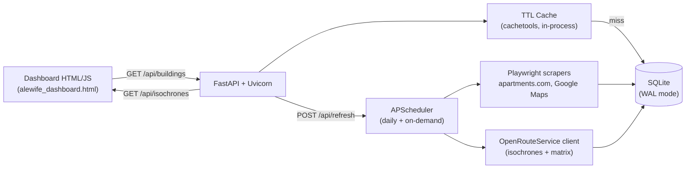
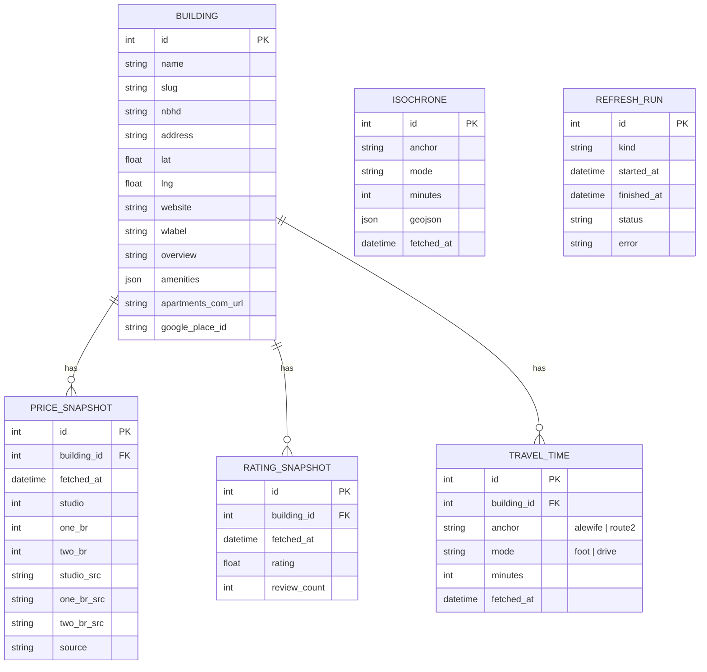
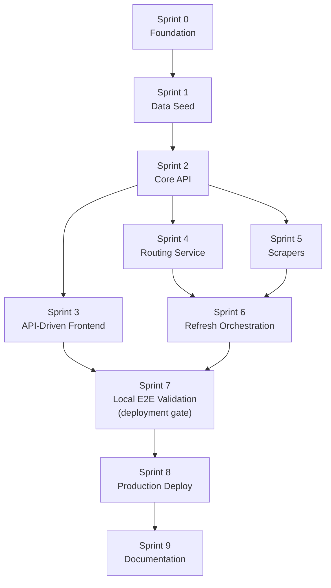

# Alewife Apartment Intelligence — Dynamic Backend Development Plan

> Turn the static reference dashboard at [Static Dashboard References/alewife_dashboard_v2.html](Static%20Dashboard%20References/alewife_dashboard_v2.html) into a live data-driven app. A Python/FastAPI backend scrapes pricing and ratings, computes walk/drive isochrones and per-building travel times via OpenRouteService, and exposes a JSON API that the HTML dashboard consumes. Deployable to a DigitalOcean droplet (primary) with a Posit Cloud fallback path.

---

## 1. Goals & Non-Goals

**Goals**

- Eliminate the hardcoded `apts` JS array and isochrone polygon literals in [alewife_dashboard_v2.html](Static%20Dashboard%20References/alewife_dashboard_v2.html) (lines 184–291).
- Keep studio / 1BR / 2BR rents, Google ratings, walk-to-T and drive-to-Rt.2 times refreshed automatically.
- Re-compute composite scores on the server so the formula change only needs one edit.
- On-demand refresh from the dashboard with a TTL cache so page loads stay fast and upstream calls stay cheap.
- Free/low-cost: no paid APIs, $6/mo DO droplet ceiling.

**Non-Goals (v1)**

- User auth, accounts, saved searches, alerting.
- Writing new apartments from the UI (seed-list is manually curated).
- Mobile app — the web dashboard is the deliverable.

---

## 2. Architecture Overview




**Data flow**

1. Dashboard loads → `GET /api/buildings` and `GET /api/isochrones`.
2. FastAPI serves from SQLite; if any row's `fetched_at` older than TTL (default 24h), a background refresh is enqueued.
3. Scrapers and routing writers update snapshot tables; the score is recomputed on read.

---

## 3. Tech Stack

- **Language:** Python 3.12
- **Web framework:** FastAPI + Uvicorn (ASGI)
- **DB:** SQLite with WAL mode (single-file, zero-ops). Upgrade path: managed Postgres on DO.
- **ORM:** SQLModel (Pydantic + SQLAlchemy combined, v2-native)
- **Scraping:** Playwright (Chromium, headless) + BeautifulSoup/selectolax for parsing
- **HTTP:** httpx (async)
- **Routing/Isochrones:** `openrouteservice` Python client against the free public API (500 isochrone req/day, 20/min — confirmed from ORS docs). OSRM public demo server as fallback for travel-time matrix.
- **Scheduling:** APScheduler (in-process `AsyncIOScheduler`)
- **Caching:** `cachetools.TTLCache` in-process (no Redis for v1)
- **Config:** `pydantic-settings` + `.env`
- **Testing:** pytest + pytest-asyncio, Playwright's `page.route` for fixture replay
- **Container:** Docker + Docker Compose; Caddy in front for TLS

**Why not Node/Next:** user prefers Python; scraping ecosystem is stronger (pandas, Playwright Python, plus simple Posit deploy option if needed).

---

## 4. Proposed Repository Layout

```
apartmentsDotLloyd/
├── App V1 Dynamic/                 # existing empty folder — becomes the app root
│   ├── backend/
│   │   ├── app/
│   │   │   ├── main.py             # FastAPI factory
│   │   │   ├── config.py           # pydantic-settings
│   │   │   ├── db.py               # engine, session, migrations
│   │   │   ├── models.py           # SQLModel tables
│   │   │   ├── schemas.py          # response DTOs
│   │   │   ├── cache.py            # TTLCache wrappers
│   │   │   ├── scoring.py          # ported calcScore()
│   │   │   ├── api/
│   │   │   │   ├── buildings.py
│   │   │   │   ├── isochrones.py
│   │   │   │   ├── refresh.py
│   │   │   │   └── health.py
│   │   │   ├── scrapers/
│   │   │   │   ├── base.py         # shared Playwright browser pool
│   │   │   │   ├── apartments_com.py
│   │   │   │   └── google_places.py
│   │   │   ├── routing/
│   │   │   │   ├── ors_client.py
│   │   │   │   └── isochrone_service.py
│   │   │   ├── scheduler.py        # APScheduler jobs
│   │   │   └── seed/
│   │   │       └── buildings_seed.json   # extracted from the static JS array
│   │   ├── tests/
│   │   ├── Dockerfile
│   │   ├── pyproject.toml
│   │   └── README.md
│   └── frontend/
│       ├── index.html              # rewrite of alewife_dashboard_v2.html (fetch-driven)
│       ├── app.js                  # extracted + data-fetching logic
│       └── styles.css              # extracted <style> block
├── docker-compose.yml
├── Caddyfile
└── DEVELOPMENT_PLAN.md             # this file
```

---

## 5. Data Model




Snapshot tables keep history so we can show price trends later without schema changes.

---

## 6. Ported Scoring Logic

Port the scoring from lines 294–302 of [alewife_dashboard_v2.html](Static%20Dashboard%20References/alewife_dashboard_v2.html) to `backend/app/scoring.py`:

```python
def calc_score(rating, walk_min, drive_min, one_br):
    r = (rating / 5) * 25 if rating else 0
    w = max(0, 25 * (1 - walk_min / 30))
    d = max(0, 20 * (1 - (drive_min - 1) / 9))
    c = max(0, 30 * (1 - (one_br - 1800) / 1700)) if one_br else 0
    return round(r + w + d + c)
```

Note: there is a bug in the HTML version where `driveMin` (undefined) is computed but then ignored; the ported version fixes that by using `drive_min` correctly.

---

## 7. Scrapers

### 7.1 `apartments_com.py`

- Input: building's `apartments_com_url` (added to seed data).
- Method: Playwright navigates, waits for `.pricingGridItem` / rent grid, extracts min rent per bed count.
- Output: `{studio, one_br, two_br, *_src}` dict.
- Robustness: per-building timeout (20s), retry once with a new browser context, log + fall back to last-known snapshot on failure.

### 7.2 `google_places.py`

- Scrapes the public Google Maps place page (`https://www.google.com/maps/place/?q=place_id:<id>`). Extracts rating and review count from the `aria-label` on the rating span — the same element the site's accessibility layer reveals, no API key needed.
- Alternative: if scraping breaks, swap to the free tier of Google Places API with only `rating,user_ratings_total` fields (~$17/1000 but covered by the $200 monthly credit).

### 7.3 Anti-bot considerations

- Rotate UA, add 1–3s jitter between buildings, use `playwright-stealth`.
- Scraping volume is tiny (18 buildings × 2 sources × once/day = 36 requests) so detection risk is low.
- Respect robots.txt for any new source before adding it.

---

## 8. Routing & Isochrones (OpenRouteService)

### 8.1 Isochrones (replaces hardcoded polygons at lines 184–192)

- `POST /v2/isochrones/foot-walking` from Alewife `(42.3954, -71.1426)` with `range=[300,600,900]` (seconds) → 5/10/15 min walk polys.
- `POST /v2/isochrones/driving-car` from Rt.2 on-ramp `(42.3995, -71.1530)` with `range=[120,300,600]` → 2/5/10 min drive polys.
- Store as GeoJSON in the `isochrone` table, refreshed weekly (roads don't change daily).

### 8.2 Per-building travel times (replaces hardcoded `walk`/`drive` ints)

- `POST /v2/matrix/foot-walking` — sources = building coords, destinations = `[Alewife]`, get walk minutes.
- `POST /v2/matrix/driving-car` — same pattern against Rt.2 on-ramp.
- Two matrix calls per refresh covers all 18+ buildings in one shot — fits comfortably in 40 req/min limit.

### 8.3 Budget

- Daily refresh: 2 matrix calls + 2 isochrone calls = 4 requests. Well under 500/day.

---

## 9. API Surface


| Method | Path                    | Response                                                      | Notes                                 |
| ------ | ----------------------- | ------------------------------------------------------------- | ------------------------------------- |
| GET    | `/api/buildings`        | `Building[]` with latest price/rating/travel + computed score | Primary dashboard call                |
| GET    | `/api/buildings/{slug}` | Single building with snapshot history                         | For future detail page                |
| GET    | `/api/isochrones`       | `{walk: GeoJSON[], drive: GeoJSON[]}`                         | Drives the Leaflet polygons           |
| POST   | `/api/refresh`          | `{run_id, status}`                                            | Manual trigger; bearer token required |
| GET    | `/api/refresh/{run_id}` | Run status + per-step log                                     | Poll from UI                          |
| GET    | `/api/health`           | DB OK + last refresh timestamps                               | For uptime checks                     |


All responses cached in `TTLCache(maxsize=8, ttl=3600)`; `/api/refresh` busts the cache.

---

## 10. Frontend Integration

The existing HTML at [alewife_dashboard_v2.html](Static%20Dashboard%20References/alewife_dashboard_v2.html) becomes `frontend/index.html` with three concrete changes:

1. Remove the `apts` literal and the six `walkIso*/driveIso*` literals (lines 184–291).
2. On load:
  ```js
   const [buildings, iso] = await Promise.all([
     fetch('/api/buildings').then(r => r.json()),
     fetch('/api/isochrones').then(r => r.json())
   ]);
  ```
3. Render polygons from `iso.walk` / `iso.drive` via `L.geoJSON` instead of hand-built `L.polygon` calls.

Leave the look/feel, CSS, and controls untouched — this stays a swap of data source, not a redesign.

---

## 11. Refresh Strategy

- **Startup:** if DB empty, run full refresh synchronously before serving traffic.
- **On-demand:** every `GET /api/buildings` checks `max(fetched_at)` per snapshot type; if beyond TTL, enqueue a background refresh (non-blocking — the client still gets stale data immediately, with a `X-Data-Freshness` header).
- **Scheduled:** APScheduler cron job at 04:00 ET daily does full refresh; isochrones only on Sundays.
- **Manual:** `POST /api/refresh` for the user to force it.

TTLs: prices 24h, ratings 72h, travel times 7d, isochrones 7d.

---

## 12. Deployment

### Primary: DigitalOcean $6/mo droplet

- Ubuntu 24.04, Docker + Docker Compose.
- Services: `api` (FastAPI + Playwright), `caddy` (TLS + reverse proxy to api:8000).
- SQLite volume mounted from host; nightly `litestream` replication to DO Spaces (~$5/mo, optional).
- Domain: point a subdomain at the droplet; Caddy auto-provisions Let's Encrypt.

### Fallback: Posit Cloud / Posit Connect

- FastAPI deployable via `rsconnect deploy fastapi` per Posit docs.
- **Caveat:** Playwright's headless Chromium is unlikely to run in the Posit sandbox. If using Posit, move scrapers out of the web process into a **GitHub Actions nightly job** that runs Playwright, writes to a small Postgres (DO managed or Supabase free tier), and have the Posit FastAPI app only read from that DB.

### Dev loop

- `docker compose up` spawns api + a Playwright-ready container.
- `make seed` loads `buildings_seed.json` generated from the static JS array.
- `make refresh` runs a full scrape against the real internet.

---

## 13. Risks & Mitigations

- **apartments.com blocks scraping.** Mitigation: low volume, stealth, wide retry window; if they harden, fall back to RentCast free tier or manual CSV uploads.
- **Google Maps DOM changes.** Mitigation: two parsers (aria-label and JSON-LD); CI check that asserts non-null rating.
- **ORS rate limit hit.** Mitigation: 4 req/day is <1% of budget; also cache isochrones for 7 days.
- **Playwright size blows up container.** Mitigation: use `mcr.microsoft.com/playwright/python` base image (~1.3 GB but pre-warmed).
- **SQLite write contention from scheduler + requests.** Mitigation: WAL mode + `BEGIN IMMEDIATE` in writers; if issues emerge, swap to Postgres (SQLModel makes this a config-only change).

---

## 14. Phased Rollout

Delivered as five short PR-sized phases so there's something working at each step.

1. **Phase 1 — Scaffold + static API** (≈ half a day)
  - FastAPI skeleton, SQLite, SQLModel tables, seed loader that parses the static JS array into `buildings_seed.json`, `/api/buildings` returns the seeded data. Frontend unchanged.
2. **Phase 2 — Frontend fetches from API**
  - Rewrite the HTML to consume `/api/buildings`. Still uses hardcoded isochrones client-side. End of this phase the dashboard works identically but is data-driven.
3. **Phase 3 — OpenRouteService integration**
  - Isochrone service + `/api/isochrones`. Travel-time matrix updates `walk`/`drive` per building. Remove hardcoded polygons from the HTML.
4. **Phase 4 — Scrapers + TTL cache**
  - Playwright apartments.com + Google Maps scrapers, snapshot tables, TTL cache, background refresh kickoff. `/api/refresh` with a bearer-token auth.
5. **Phase 5 — Deploy**
  - Dockerfile, docker-compose, Caddy, DO droplet. APScheduler cron. Smoke tests + monitoring.

---

## 15. Open Questions (to revisit before Sprint 1)

- Which buildings need a manual `apartments_com_url` that isn't trivially derivable from the name? We can populate this once at seed time.
- Do we want to keep the Somerville/Belmont income-restricted buildings in scope of scraping (most don't publish prices on apartments.com)? Likely leave them as manual entries.
- Subdomain + DNS provider for the deployed version.
- `MBTA_API_KEY` is already in the repo's `.env` — do we want to enrich walk-to-T with live Red Line headways in a later sprint? Out of scope for v1.

---

## 16. Engineering Standards (applied in every sprint)

These are the non-negotiables that every sprint's Definition of Done must satisfy, derived from the repo's `.cursorrules`:

- **Style:** PEP 8, `snake_case` for Python, 2-space indent for JS.
- **Linting/Formatting:** `ruff check .` and `ruff format --check .` pass.
- **Types:** Pydantic/SQLModel models typed end-to-end; `mypy --strict` on `app/` passes.
- **Testing:** `pytest` green. Every new module ships with unit tests; every new endpoint has a `TestClient` integration test.
- **Naming:** Functions/variables describe intent, not mechanics. No magic numbers — named constants (e.g. `DEFAULT_PRICE_TTL_HOURS`).
- **Single responsibility:** Functions do one thing; extract nested conditionals into helpers.
- **Comments:** Docstrings on public functions explaining *why* and edge cases, not line-by-line narration.
- **Secrets:** Nothing from `.env` is committed. `.env.example` lists required keys with placeholder values. Real `.env` stays in `.gitignore`.
- **Commits:** One logical change per commit; message references the sprint (`sprint-3: fetch buildings from API`).

---

## 17. Sprint-by-Sprint Implementation Roadmap

Nine sequential sprints. Each sprint is independently testable — its verification steps do **not** rely on outputs from later sprints. Sprints 1–6 use seeded/mocked data where external services aren't yet wired, so the app is always in a demonstrable state. Sprint 7 is the mandatory full local end-to-end validation **before** any deployment work begins in Sprint 8.

### Sprint 0 — Foundation & Tooling

**Goal:** Stand up the repository skeleton, tooling, and CI so subsequent sprints only add features.

**Deliverables**

- `App V1 Dynamic/backend/pyproject.toml` with FastAPI, Uvicorn, SQLModel, httpx, pydantic-settings, pytest, pytest-asyncio, ruff, mypy as dependencies.
- `App V1 Dynamic/backend/app/__init__.py`, `main.py` (bare "hello" FastAPI app), `config.py` (pydantic-settings with `.env` loading).
- `App V1 Dynamic/backend/.env.example` listing `ORS_API_KEY`, `REFRESH_BEARER_TOKEN`, `DATABASE_URL`, `MBTA_API_KEY` (optional).
- Repo-level `Makefile` with `install`, `lint`, `format`, `test`, `run`, `clean` targets.
- Root `.gitignore` additions: `.venv/`, `*.db`, `App V1 Dynamic/backend/.env`, `playwright-report/`.
- `.github/workflows/ci.yml` — lint + tests on push/PR.
- One smoke test: `GET /api/health` returns `{"status": "ok"}`.

**Verification (done in order)**

1. `make install` succeeds in a fresh venv.
2. `make lint` passes.
3. `make test` passes the health-check test.
4. `make run` starts Uvicorn; `curl localhost:8000/api/health` returns 200 with expected JSON.
5. CI run on a test branch turns green.

**Acceptance criteria:** Clean clone → `make install && make test` works. No feature code yet.

---

### Sprint 1 — Data Seed & Building Catalog

**Goal:** Parse the static JS `apts` array into a JSON seed file and load it into SQLite. No network, no live data yet.

**Deliverables**

- `App V1 Dynamic/backend/app/db.py` — SQLModel engine + session factory, SQLite WAL pragma.
- `App V1 Dynamic/backend/app/models.py` — `Building` table per Section 5 (plus placeholder fields `current_rating`, `current_one_br` that later sprints populate; seed values come from the static JS).
- `App V1 Dynamic/backend/app/seed/buildings_seed.json` — generated by a one-shot script `scripts/extract_seed.py` that parses lines 195–291 of [alewife_dashboard_v2.html](Static%20Dashboard%20References/alewife_dashboard_v2.html) into structured JSON. The script is kept in-repo for reproducibility but run only once.
- `App V1 Dynamic/backend/app/seed/loader.py` — idempotent `load_buildings()` that upserts on `slug`.
- CLI entry point: `python -m app.seed.loader --seed-file ...`.
- Unit tests: parser round-trips all 20 buildings; loader inserts 20 rows then is a no-op on rerun.

**Verification**

1. `python scripts/extract_seed.py` produces a file with 20 entries matching the names in the static HTML.
2. `pytest tests/test_seed_loader.py` passes (includes idempotency test).
3. `sqlite3 alewife.db "select count(*), min(rating), max(rating) from building;"` reports `20, 2.9, 4.9`.
4. Spot-check: `select name, rating from building where slug='hanover-alewife';` → rating 4.8.

**Acceptance criteria:** DB is reproducibly seeded from JSON; no FastAPI changes required yet.

---

### Sprint 2 — Core API (seeded data only)

**Goal:** Serve the seeded buildings via a versioned JSON API. No scraping or routing yet.

**Deliverables**

- `App V1 Dynamic/backend/app/scoring.py` — `calc_score()` ported from lines 294–302 of the static HTML, with the `driveMin` bug fix noted in Section 6.
- `App V1 Dynamic/backend/app/schemas.py` — `BuildingOut` response DTO with computed `score`.
- `App V1 Dynamic/backend/app/api/buildings.py` — `GET /api/buildings`, `GET /api/buildings/{slug}`.
- `App V1 Dynamic/backend/app/api/health.py` — expanded to report DB row count and schema version.
- Router wiring in `main.py`; OpenAPI docs available at `/docs`.
- Tests: `TestClient` integration tests covering list, detail, 404, score correctness against a known building.

**Verification**

1. `pytest` green (add ~6 new tests).
2. `curl localhost:8000/api/buildings | jq 'length'` → 20.
3. `curl localhost:8000/api/buildings/hanover-alewife | jq .score` returns an integer; manually verify it matches the value the static HTML renders for that building.
4. `/docs` loads and shows both endpoints.

**Acceptance criteria:** Backend serves seeded data shaped like the final response. Frontend in Sprint 3 can consume it without further backend changes.

---

### Sprint 3 — API-Driven Frontend

**Goal:** Replace the static HTML's hardcoded `apts` literal with a fetch against the Sprint 2 API. Isochrones stay hardcoded this sprint (Sprint 5 handles them).

**Deliverables**

- `App V1 Dynamic/frontend/index.html` — copy of the static dashboard with the `apts = [...]` literal removed.
- `App V1 Dynamic/frontend/app.js` — extracted from the inline `<script>`, refactored into small functions (`loadBuildings`, `renderTable`, `renderMarkers`, `wireControls`) per `.cursorrules` single-responsibility guidance.
- `App V1 Dynamic/frontend/styles.css` — extracted from the inline `<style>` block.
- Static file serving added to FastAPI via `StaticFiles` mounted at `/`, so `http://localhost:8000/` serves the dashboard and `/api/*` serves JSON.
- A `build_url_for_api()` JS helper that picks `window.location.origin` in production and a configurable dev origin locally.

**Verification**

1. With the backend running, open `http://localhost:8000/` in a browser. The dashboard loads, 20 markers appear, the table populates, all interactions (sort, filter, row-click-to-map) work.
2. Open DevTools Network tab → confirm exactly one `GET /api/buildings` request; no inline apartment data in page source.
3. Visual diff vs the static reference: identical map layout, colors, table columns. (Isochrones still hardcoded and visible.)
4. Automated: a Playwright smoke test asserts table has 20 rows and at least one marker has the expected popup text.

**Acceptance criteria:** Dashboard is fully data-driven for buildings; works identically to the static reference.

---

### Sprint 4 — Routing Service (travel times + isochrones)

**Goal:** Replace hardcoded `walk`/`drive` minutes and isochrone polygons with OpenRouteService-computed values.

**Deliverables**

- `App V1 Dynamic/backend/app/routing/ors_client.py` — thin httpx wrapper around ORS `matrix` and `isochrones` endpoints, keyed via `ORS_API_KEY`.
- `App V1 Dynamic/backend/app/routing/travel_time_service.py` — `refresh_travel_times()` computes foot-walk to Alewife and drive to Rt.2 ramp for every building, writes to `travel_time` table.
- `App V1 Dynamic/backend/app/routing/isochrone_service.py` — `refresh_isochrones()` fetches 5/10/15-min walk polys from Alewife and 2/5/10-min drive polys from Rt.2 ramp, writes GeoJSON to `isochrone` table.
- `App V1 Dynamic/backend/app/api/isochrones.py` — `GET /api/isochrones` returns `{"walk": [...], "drive": [...]}`.
- `BuildingOut` now pulls `walk_min` and `drive_min` from `travel_time` table (fallback to seed value if none yet).
- CLI: `python -m app.routing.refresh_all`.
- Frontend: `index.html` replaces the six `walkIso*`/`driveIso*` literals with a `fetch('/api/isochrones')` call and `L.geoJSON(...)` for rendering.
- Tests with recorded HTTP fixtures (via `pytest-httpx` or a local `responses` library) so CI doesn't call ORS.

**Verification**

1. `ORS_API_KEY=... python -m app.routing.refresh_all` populates `travel_time` (20 × 2 = 40 rows) and `isochrone` (6 rows).
2. Spot-check: computed walk time for Cambridge Park (nearest building) is between 1 and 4 minutes; Arlington 360 is ≥ 25 minutes. Compare drive times against a hand-run Google Maps directions check — tolerance ±2 minutes.
3. `pytest tests/test_routing.py` passes using fixtures; no live ORS call in CI.
4. Open `/` in browser — map shows isochrone polygons that are road-shaped (not the hand-drawn circles from the static version).
5. API budget check: one full refresh costs 2 matrix + 2 isochrone = 4 ORS requests. Log this.

**Acceptance criteria:** No hardcoded isochrone polygons or travel-time ints remain in the frontend. All geo-data flows from the DB.

---

### Sprint 5 — Scrapers (prices + ratings)

**Goal:** Replace hardcoded rents and Google ratings with live scrapes.

**Deliverables**

- `App V1 Dynamic/backend/app/scrapers/base.py` — Playwright browser-pool context manager with stealth + jitter utilities.
- `App V1 Dynamic/backend/app/scrapers/apartments_com.py` — extracts studio/1BR/2BR min rents per building; graceful null returns + structured error logs.
- `App V1 Dynamic/backend/app/scrapers/google_places.py` — extracts `rating` and `review_count` from the public Google Maps place page using `google_place_id` on the Building row.
- `price_snapshot` and `rating_snapshot` tables (Section 5) + SQLModel models + `refresh_prices()`, `refresh_ratings()` services.
- Building seed updated to include `apartments_com_url` and `google_place_id` for all 20 rows. Where unavailable (e.g. Fresh Pond Apartments, Clarendon Hill) the field is `null` and scrapers skip gracefully.
- `BuildingOut` now prefers the latest snapshot; falls back to seed value if no snapshot yet.
- Fixture-based tests: saved HTML pages for three representative buildings; parsers tested offline.
- CLI: `python -m app.scrapers.refresh_all`.

**Verification**

1. `playwright install chromium` runs once locally.
2. `python -m app.scrapers.refresh_all --limit 3 --slug hanover-alewife,fuse-cambridge,tempo-cambridge` populates three rows each in `price_snapshot` and `rating_snapshot`.
3. Values within ±$100 of current apartments.com listings for those three buildings (manual check at scrape time).
4. `pytest tests/test_scrapers.py` green using saved HTML fixtures.
5. Hit `/api/buildings/hanover-alewife` — `one_br` and `rating` now come from the snapshot (confirm via changed `price_source` label).
6. Run scraper against a building with `null` URL — it's skipped, no crash.

**Acceptance criteria:** Prices and ratings refresh from live sources; no-URL buildings handled gracefully; CI runs fully offline.

---

### Sprint 6 — Refresh Orchestration & Caching

**Goal:** Make refreshes safe, scheduled, and user-triggerable without blocking requests.

**Deliverables**

- `App V1 Dynamic/backend/app/cache.py` — TTL cache wrapping expensive `GET /api/buildings` and `/api/isochrones` responses.
- `App V1 Dynamic/backend/app/scheduler.py` — `AsyncIOScheduler` started in FastAPI lifespan; cron rules per Section 11 (prices 24h, ratings 72h, travel 7d, isochrones 7d).
- `App V1 Dynamic/backend/app/api/refresh.py` — `POST /api/refresh` (bearer-token-auth) enqueues a background refresh and returns a `run_id`. `GET /api/refresh/{run_id}` reports status.
- `refresh_run` table + `RefreshRunService` that wraps each of the Sprint 4/5 services and logs success/failure per step.
- Response header `X-Data-Freshness: {max_age_seconds}` on `/api/buildings`.
- Frontend: small "Last refreshed N min ago — refresh now" UI chip in the header that calls `/api/refresh` with the token from a config.

**Verification**

1. `POST /api/refresh` with a bad token → 401. With the correct token → 202 and a `run_id`.
2. `GET /api/refresh/{run_id}` shows `started_at`, transitions through `running` to `succeeded`, per-step timings logged.
3. Immediately after, `/api/buildings` returns updated `fetched_at` fields; `X-Data-Freshness` is < 60.
4. In a test harness with APScheduler accelerated (`run_date` = now + 2s), confirm the cron job fires and updates data without an HTTP trigger.
5. Cache smoke test: two consecutive `/api/buildings` calls — second one's DB query count is zero (verified via SQLAlchemy event listener).

**Acceptance criteria:** One manual endpoint + scheduled job refresh everything reliably. No long-running requests on the critical path.

---

### Sprint 7 — Local Full-Stack Validation (gate before deployment)

**Goal:** Prove the entire app runs locally end-to-end against real external services. **This sprint is mandatory — Sprint 8 may not start until it passes.**

**Deliverables**

- `App V1 Dynamic/docker-compose.local.yml` — spins up the API container only (no Caddy, no TLS). SQLite volume in a bind mount for easy inspection.
- `App V1 Dynamic/backend/Dockerfile` — based on `mcr.microsoft.com/playwright/python:latest` so Chromium is preinstalled.
- `Makefile` targets `up-local`, `down-local`, `logs-local`, `seed`, `refresh-all`, `smoke-e2e`.
- `App V1 Dynamic/backend/tests/e2e/test_smoke.py` — end-to-end test (opt-in via `E2E=1`) that:
  - boots the containerized app,
  - calls `/api/refresh` with the real ORS key and real scrapers,
  - waits for the run to finish,
  - asserts every building has a price snapshot from the last hour,
  - asserts 6 isochrones present,
  - hits `/` and asserts HTML contains the expected building names.
- `App V1 Dynamic/RUN_LOCALLY.md` — **standalone step-by-step guide** for running the full app locally, written for a reader who hasn't seen the project. Must be self-contained (no outbound clicks required to succeed) and uses the developer README voice from `[.cursor/rules/developer_readme_format.mdc](.cursor/rules/developer_readme_format.mdc)`. Required sections:
  1. **What you'll have at the end** (1 sentence + screenshot placeholder)
  2. **Prerequisites** — exact versions: Git, Docker Desktop (or Podman), a free OpenRouteService account, Python 3.12 only if running without Docker
  3. **One-time setup** — numbered steps: clone → `cp App\ V1\ Dynamic/backend/.env.example App\ V1\ Dynamic/backend/.env` → get an ORS key at the linked URL → paste into `.env` → set `REFRESH_BEARER_TOKEN` to any string
  4. **Run the app** — single command: `make up-local` (document the `docker compose -f App\ V1\ Dynamic/docker-compose.local.yml up` fallback for users without `make`)
  5. **First-run data load** — `make seed && make refresh-all`; expected log lines and timings (~2 min)
  6. **Open the dashboard** — `http://localhost:8000/`; what to look for (20 markers, populated table, isochrone polygons)
  7. **Verifying it works** — a short copy-pasteable `curl` or PowerShell block that hits `/api/health` and `/api/buildings | ConvertFrom-Json | Measure-Object` (Windows-friendly since the repo is on Windows)
  8. **Common issues** — Playwright-download timeout, port 8000 in use, ORS 403, stale DB
  9. **Stopping / resetting** — `make down-local`, how to wipe the SQLite file
- `App V1 Dynamic/LOCAL_VALIDATION.md` — separate QA checklist for the **maintainer** (not a setup doc): visual parity with the static reference, refresh button works, freshness chip updates, no console errors, dashboard responsive below 768px. Referenced from `RUN_LOCALLY.md` only as a further-reading link.

**Verification (all must pass)**

1. Clean clone, fresh `.env`, `make up-local` → app reachable at `http://localhost:8000/` within 60s.
2. `make seed && make refresh-all` completes without errors on a machine with no prior state.
3. `E2E=1 make smoke-e2e` passes on the developer laptop.
4. The manual QA checklist in `LOCAL_VALIDATION.md` is walked through by the user and every item ticked.
5. **A second person (or the user on a clean machine) follows only `RUN_LOCALLY.md` end-to-end and reaches a working dashboard without asking any questions.** Any step that required "figuring it out" is a bug in the doc and must be fixed before Sprint 8.
6. Resource check: container memory stays under 1.5 GB during a full refresh.

**Acceptance criteria:** A reader who has never seen the project can clone, set `.env`, follow `RUN_LOCALLY.md`, and see a working live-data dashboard in under 15 minutes. If any criterion fails, Sprint 8 is blocked.

---

### Sprint 8 — Production Deployment

**Goal:** Ship to a paid DigitalOcean droplet with TLS and nightly refresh.

**Deliverables**

- `App V1 Dynamic/docker-compose.yml` (prod) — adds `caddy` service and production env vars; no local-only volumes.
- `App V1 Dynamic/Caddyfile` — TLS via Let's Encrypt, reverse proxy to `api:8000`.
- `App V1 Dynamic/deploy/bootstrap_droplet.sh` — one-shot provisioning script for a fresh Ubuntu 24.04 droplet (installs Docker, creates non-root deploy user, clones repo, templates `.env`, starts services).
- `.github/workflows/deploy.yml` — on push to `main`, SSH to the droplet and `docker compose pull && up -d`. Secrets pulled from GitHub Actions secrets, not committed.
- Optional: `litestream` sidecar for SQLite replication to a DO Space.
- Runbook in `App V1 Dynamic/deploy/RUNBOOK.md`: common failures (Playwright install fail, ORS key rotation, scraper selector break) and remediation.
- **Posit Cloud fallback path documented** in the runbook: if DO is unavailable, use GitHub Actions cron to run scrapers + push data to a Supabase Postgres, then deploy a read-only FastAPI to Posit Connect using the `POSIT_CONNECT_PUBLISHER` token already in `.env`.

**Verification**

1. Run `bootstrap_droplet.sh` against a newly-created $6/mo droplet → app serving at the chosen subdomain with a valid TLS cert within 10 minutes.
2. `GET https://<domain>/api/health` returns 200 with non-null `last_refresh_*` timestamps.
3. Force-push a trivial change to `main` → GitHub Actions deploy workflow green; site updated.
4. Leave for 24 hours; verify the APScheduler nightly job ran (check `/api/refresh` history + container logs).
5. Uptime check set up (UptimeRobot or equivalent) hitting `/api/health` every 5 minutes.

**Acceptance criteria:** Public URL serves the live dashboard; nightly refresh runs autonomously; redeploys are a one-liner.

---

### Sprint 9 — Documentation & Handoff

**Goal:** Two complete app-level READMEs — one for humans, one optimized for Cursor — plus supporting docs so anyone (or any future Cursor session) can ramp up fast.

Every doc produced in this sprint conforms to the matching rule in `.cursor/rules/`. The two audiences are intentionally served by **separate files** because the rules in the repo specify different structures and content for each.

**Deliverables**

**1. Human-facing README — `App V1 Dynamic/README.md`** (follows `[.cursor/rules/developer_readme_format.mdc](.cursor/rules/developer_readme_format.mdc)`)

- Single `#` title; `##` for Overview, Requirements, Installation, Usage, Configuration, API Reference, Deployment, Contributing, License.
- TOC with anchor links immediately after a 1–3 sentence intro.
- Required sections, in order:
  - **Overview** — what the app does, 2–3 bullets + screenshot.
  - **Architecture** — the Section 2 mermaid diagram, kept small.
  - **Requirements** — Python 3.12, Docker Desktop, ORS account.
  - **Quick start** — numbered 3-step block that links out to `[RUN_LOCALLY.md](App%20V1%20Dynamic/RUN_LOCALLY.md)` for the expanded walkthrough.
  - **Usage** — one code block showing a typical `/api/buildings` response.
  - **Configuration** — table of env vars and their purpose (names only, never values).
  - **API Reference** — the endpoint table from Section 9 + link to `/docs` (Swagger UI).
  - **Deployment** — 1-paragraph summary + link to `deploy/RUNBOOK.md`.
  - **Contributing** — link to `CONTRIBUTING.md`.
  - **License** — one line.
- Tone: direct, scannable, no "obvious"/"critical" filler (enforced by `.cursor/rules/readme_docs.mdc` writing guidance).
- Links to `CURSOR.md` with a one-line note: *"If you're Cursor (or another AI coding tool), read `CURSOR.md` first."*

**2. Cursor-facing README — `App V1 Dynamic/CURSOR.md`** (follows `[.cursor/rules/cursor_readme_format.mdc](.cursor/rules/cursor_readme_format.mdc)`)

- Purpose stated up top: *"This file exists so Cursor can understand and safely modify this project without re-reading the full codebase."*
- Required sections, in order per the rule:
  - **Project summary** — one paragraph.
  - **Project structure** — explicit repo-relative paths for every meaningful folder/file with its role (e.g. `App V1 Dynamic/backend/app/scrapers/apartments_com.py` — *Playwright scraper, uses `base.BrowserPool`; writes to `price_snapshot`*).
  - **Tech stack & environment** — versions, package manager, every required env var name with its purpose.
  - **Entry points & run order** — `make seed` → `make up-local` → `make refresh-all`.
  - **Conventions & patterns** — links to each relevant file in `.cursor/rules/`: `coding_style.mdc`, `developer_readme_format.mdc`, `cursor_readme_format.mdc`, `readme_docs.mdc`. Call out naming patterns (snake_case Python, 2-space JS, scraper naming `{source}.py`, snapshot tables `{kind}_snapshot`).
  - **APIs and libraries** — table linking to official docs: FastAPI, SQLModel, Playwright, OpenRouteService, Leaflet, MBTA V3 API (future).
  - **Canonical code examples** — one short snippet each for:
    - *"How we call ORS in this project"* → points to `routing/ors_client.py`.
    - *"How we add a building"* → points to `seed/buildings_seed.json` + re-run `make seed`.
    - *"How we add a scraper"* → points to `scrapers/base.py` pattern.
  - **Testing conventions** — fixture locations, how to run `E2E=1 make smoke-e2e`, where mocks live.
  - **Known caveats** — scraper selectors drift; ORS free-tier limits; SQLite write contention notes from Section 13.
  - **Reference links** — table of external docs.
- Written in present tense, declarative, explicit paths always, no prose-y intro paragraphs between sections.

**3. Supporting docs**

- Root `README.md` (repo level) — rewrite the existing two-line file. Shorter than the app-level one: project pitch, link into `App V1 Dynamic/README.md` for the app, link to `DEVELOPMENT_PLAN.md` for the history, link to `Static Dashboard References/` for the original mockups.
- `App V1 Dynamic/backend/README.md` — dev setup, commands, directory layout, how to add a building, how to add a scraper. Follows `developer_readme_format.mdc`.
- `App V1 Dynamic/frontend/README.md` — how the fetch flow works, how to tweak the legend, how to add a table column. Follows `developer_readme_format.mdc`.
- `App V1 Dynamic/deploy/RUNBOOK.md` — finalized from Sprint 8.
- `CONTRIBUTING.md` at repo root — code standards from Section 16, commit conventions, PR checklist.
- `CHANGELOG.md` — entries for each completed sprint.
- Inline docstrings on every public function/class per `.cursorrules`.

**Verification**

1. `RUN_LOCALLY.md` (from Sprint 7) and the app-level `README.md` together take a fresh reader from `git clone` to a working dashboard in under 15 minutes. Time it.
2. A new Cursor chat in an empty context is given only `App V1 Dynamic/CURSOR.md` and asked *"Add a new scraper for ApartmentList.com"* — it should propose a correctly-placed file under `backend/app/scrapers/` using the `base.BrowserPool` pattern and the right snapshot table, **without** re-reading the codebase. Record the test in `CURSOR.md` as the expected self-check.
3. All markdown files pass `lychee` link-check in CI.
4. `README.md` and `CURSOR.md` each pass their rule's checklist (the final checklist section in each `.mdc` file). Add an automated verification script `scripts/check_readme_rules.py` that asserts required section headers are present.
5. `ruff` with pydocstyle enabled reports zero missing-docstring errors on `backend/app/`.
6. Every API endpoint in `/docs` shows a non-empty description.

**Acceptance criteria:** Two distinct, rule-conforming READMEs exist side by side at the app level, each serving its intended reader. Project is operable and extensible from the docs alone. Work is formally "done."

---

## 18. Credentials Checklist (do this before Sprint 0)

Only one external key is strictly required to build the full app. Everything else is optional or deferred.

### Required for local development

- **OpenRouteService API key** — [openrouteservice.org/dev/#/signup](https://openrouteservice.org/dev/#/signup). Free tier gives 500 isochrone + 2000 matrix req/day (we use ~4). Set `ORS_API_KEY` in `App V1 Dynamic/backend/.env`.
- **Refresh bearer token** — self-generated, no website. PowerShell: `[guid]::NewGuid().ToString("N")`. Set `REFRESH_BEARER_TOKEN` in `.env`. PowerShell command one liner: 
  - $b = New-Object byte[] 32; [[System.Security](http://System.Security).Cryptography.RandomNumberGenerator]::Create().GetBytes($b); [Convert]::ToBase64String($b) -replace '[+/=]',''

### Not needed (scraped)

- apartments.com — no key (Playwright scraper).
- Google Maps ratings — no key (public place pages). Fallback if scraping breaks: [Google Places API](https://cloud.google.com/maps-platform), defer until needed.

### Optional enhancement

- **MBTA V3 API key** — [api-v3.mbta.com/portal](https://api-v3.mbta.com/portal). Already present as `MBTA_API_KEY` in the repo `.env`. Not used in v1; reserve for a future "live Red Line headways" feature.

### Required for deployment (Sprint 8 only)

- **DigitalOcean account** — [cloud.digitalocean.com/registrations/new](https://cloud.digitalocean.com/registrations/new). $6/mo droplet.
- **DigitalOcean Personal Access Token** *(optional — only for GitHub Actions auto-deploy)* — [cloud.digitalocean.com/account/api/tokens](https://cloud.digitalocean.com/account/api/tokens). Store as repo secret `DO_TOKEN`.
- **Domain name** *(optional — for HTTPS)* — any registrar (Namecheap / Porkbun / Cloudflare Registrar). Point an A record at the droplet IP; Caddy handles Let's Encrypt automatically.
- **Posit Connect token** *(optional — only if taking the Posit fallback path)* — already in `.env` as `POSIT_CONNECT_PUBLISHER`.

### Existing keys to ignore for this project

`TEST_API_KEY`, `OPENAI_API_KEY`, `OLLAMA_API_KEY` in `.env` are unrelated to this app. Leave them as-is.

### Secrets hygiene

- Confirm `.env` is listed in `.gitignore` (it is).
- Create `App V1 Dynamic/backend/.env.example` in Sprint 0 with placeholder values for every key listed above. Commit that file, never the real `.env`.

---

## 19. Sprint Dependency Graph




Sprints 3, 4, and 5 can proceed in parallel once Sprint 2 lands, since none of them depend on each other's outputs. Sprints 6 onward are strictly sequential.